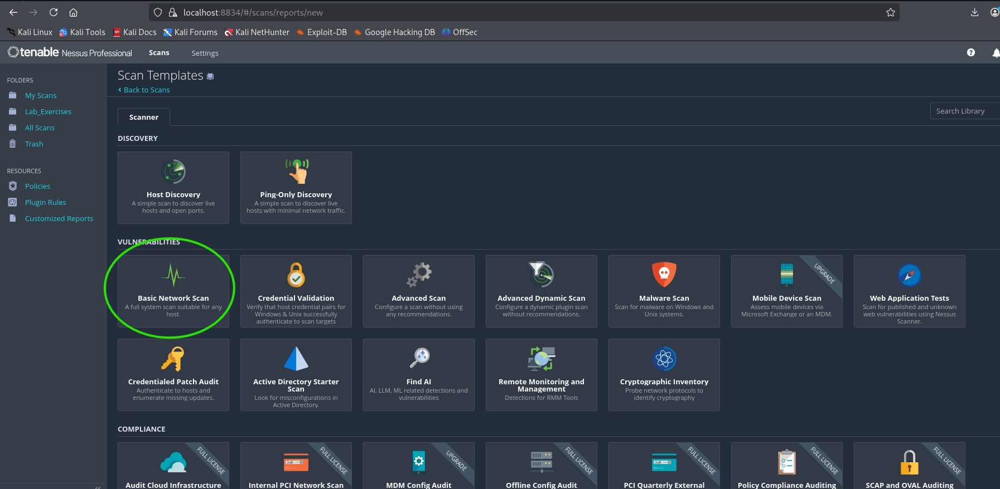
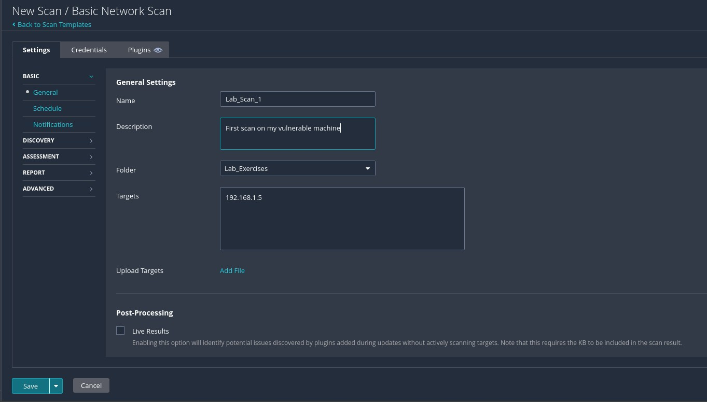
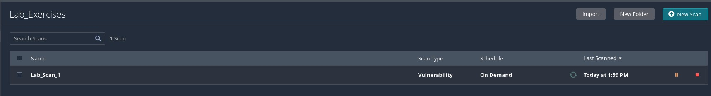
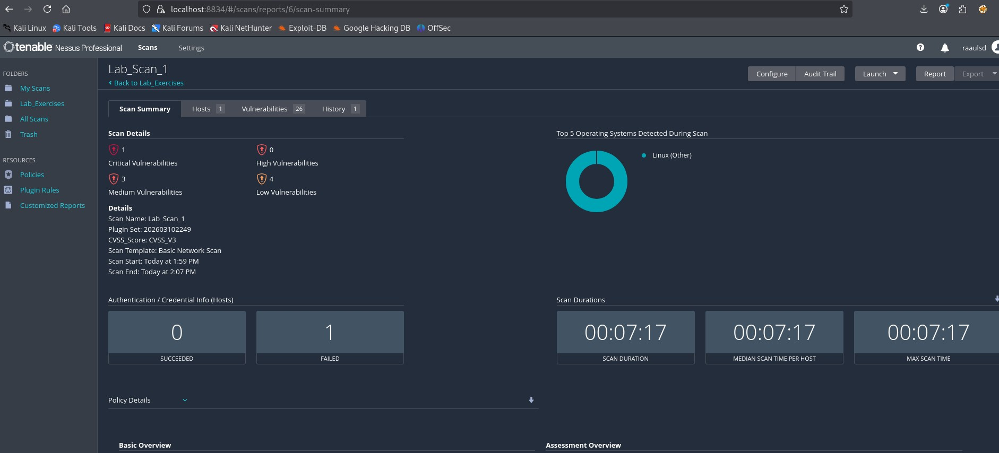
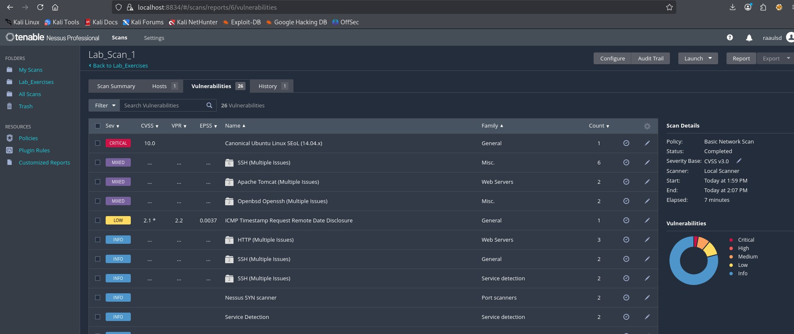
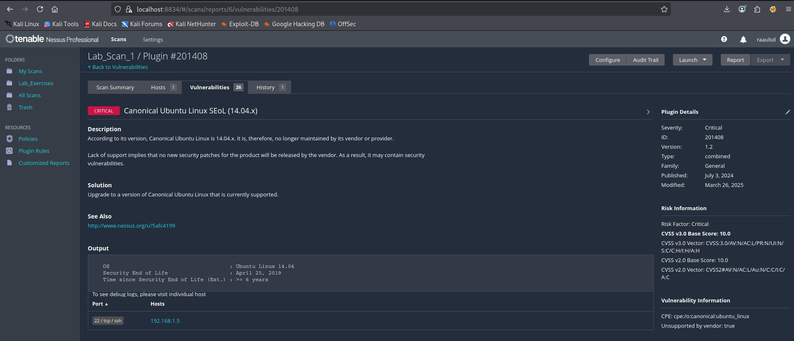

# 🛡️ Nessus Professional: Technical Deployment & Usage Guide

This project provides a comprehensive guide on deploying, configuring, and using **Nessus Professional** to perform vulnerability assessments in a controlled lab environment.

---

## 📖 Table of Contents
1. [What is Nessus Professional?](#1-what-is-nessus-professional)
2. [Reference Deployment Environment](#2-reference-deployment-environment)
3. [Deployment & Configuration Guide](#3-deployment--configuration-guide)
4. [Standard Operating Procedure: Vulnerability Scanning](#4-standard-operating-procedure-vulnerability-scanning)
5. [Reporting & Analysis of Results](#5-reporting--analysis-of-results)

---

## 1. What is Nessus Professional?

**Nessus Professional** is the industry-standard vulnerability assessment solution for security practitioners developed by **Tenable**. It is designed to automate the point-in-time identification of vulnerabilities, configuration issues, and malware across a wide range of assets.

In professional production environments, Nessus is a core component of the **Vulnerability Management (VM) lifecycle**, providing the data required for risk assessment and remediation planning.

### Core Functionalities:
* **Comprehensive Detection:** Features over **180,000 plugins**, updated daily to cover the latest vulnerabilities (CVEs), malware, and configuration trends.
* **Scalable Scanning:** Capable of auditing cloud infrastructure, virtualized environments, and physical network devices (routers, switches, firewalls).
* **Compliance Auditing:** Includes templates for industry standards such as **PCI DSS, HIPAA, and CIS Benchmarks**, allowing organizations to verify if their systems meet regulatory requirements.
* **Authenticated vs. Unauthenticated Scans:**
    * *Unauthenticated:* Provides an "outside-in" view of what an attacker can discover without credentials.
    * *Authenticated (Credentialed):* Logs into the system to perform a deep inspection of local software, registry keys, and missing patches.

---

## 2. Reference Deployment Environment

To demonstrate the tool's capabilities, this manual utilizes a standard virtualization architecture:

* **Scanner Node:** Kali Linux (Debian-based) running Nessus Professional.
* **Host System:** Windows 11 (Physical Host).
* **Hypervisor:** Oracle VM VirtualBox.
* **Target Node:** Ubuntu Desktop.

> **Note:** Proper network configuration in VirtualBox is crucial. Both the Scanner and the Target must be on the same subnet to allow Nessus to perform successful discovery and deep packet inspection.

---

## 3. Deployment & Configuration Guide

The deployment of Nessus Professional follows a standardized process: acquisition of the official package, installation of the service, and initialization of the plugin database.

### 3.1. Package Acquisition
Before installation, the Nessus binary must be obtained from the official vendor repository:
1. Navigate to the [Tenable Download Portal](https://www.tenable.com/downloads/nessus).
2. Select the appropriate package: **Linux - Debian - amd64**.
3. Download the `.deb` file to your target system (e.g., `~/Downloads`).


### 3.2. Installation on Linux (Debian/Kali)
Once the package is downloaded, execute the following command in the terminal to install it:

```bash
dpkg -i Nessus-10.11.3-debian10_amd64.deb
```


After installation, activate the Nessus daemon (nessusd) to start the service:

```bash
systemctl start nessusd
systemctl enable nessusd
```


### 3.3. Initial Setup
Access the management console via https://localhost:8834.
* **Security Note:**: A browser warning will appear due to the self-signed SSL certificate; select "Advanced" and "Proceed" to continue.


* **Trial Activation:** Select the option **"Start a trial of Nessus Professional"**.


* **Registration:** In the following screen, provide your email address. You will receive an activation code in your inbox.
* **License Activation:** After verifying your email and obtaining the **Activation Code**, press "Continue" to proceed.


* **User Account Creation:** Create your primary administrator account by defining a secure username and password.
* **Plugin Initialization:** The system will automatically download and compile the vulnerability plugins. This is a vital step, as it defines the scanner's detection capabilities.


---

## 4. Standard Operating Procedure: Vulnerability Scanning

Once the plugin initialization is complete, we are ready to perform our first security assessment. 

### 4.1. Selecting a Scan Policy
Nessus offers a wide variety of templates tailored to different security needs. While we will utilize the **Basic Network Scan** for this deployment, it is important to understand the versatility of the tool. These are the most used templates:

* **Basic Network Scan:** The "all-in-one" template. It provides comprehensive detection for common vulnerabilities, open ports, and system misconfigurations. It is the ideal choice for general-purpose discovery.
* **Advanced Scan:** Allows granular control over every aspect of the scan, from port ranges to timing and specific plugin selection.
* **Malware Scan:** Specifically designed to detect malicious processes and indicators of compromise (IoC) on a system.
* **Compliance/Configuration Audits:** Used to verify that systems adhere to specific industry standards (e.g., CIS benchmarks or custom organizational policies).

### 4.2. Configuring the Assessment
To begin scanning our target (the vulnerable Ubuntu instance), we follow these steps:

1. Click **"New Scan"** and select the **"Basic Network Scan"** template.



2. **Naming:** Assign a descriptive name to your project (e.g., `Lab_Scan_1`).
3. **Folder Organization:** Organize your scans into folders to maintain a clean project structure.
4. **Target Definition:** In the **"Targets"** field, input the IP address of your Ubuntu instance (e.g., `192.168.1.5`).



5. **Save & Launch:** Click **"Save"** to store the policy, then click the **"Launch"** button (play icon) to begin the assessment.



---

## 5. Reporting & Analysis of Results

Once the scan is completed, the results must be interpreted to assess the organization's risk exposure. Nessus categorizes findings by severity, allowing security teams to prioritize remediation efforts based on the **CVSS (Common Vulnerability Scoring System)**.

### 5.1. Summary Overview
The scan summary provides a high-level assessment of the host's security posture.



* **Scan Duration:** 00:07:17.
* **Findings:** Identified a total of 26 vulnerabilities, with at least one **Critical** issue that requires immediate attention.

### 5.2. Vulnerability Analysis
By accessing the **"Vulnerabilities"** tab, we obtain a detailed breakdown of every risk detected. 



The most critical finding identified is the **"Canonical Ubuntu Linux EoL (14.04.x)"** (Plugin #201408). 

* **Why is this Critical?** This version of Ubuntu reached its End of Life on April 25, 2019. It no longer receives security patches, meaning any new vulnerability discovered in the kernel or base libraries will remain unpatched, leaving the system completely exposed to exploitation.



### 5.3. Remediation Strategy
For every finding, Nessus provides a **Solution**. In the case of the Critical EoL issue, the recommendation is:
> *"Upgrade to a version of Canonical Ubuntu Linux that is currently supported."*

In a professional production environment, this would trigger an immediate migration or upgrade project. Leaving an EoL system connected to the production network is a significant compliance violation (e.g., under PCI-DSS or GDPR standards).
