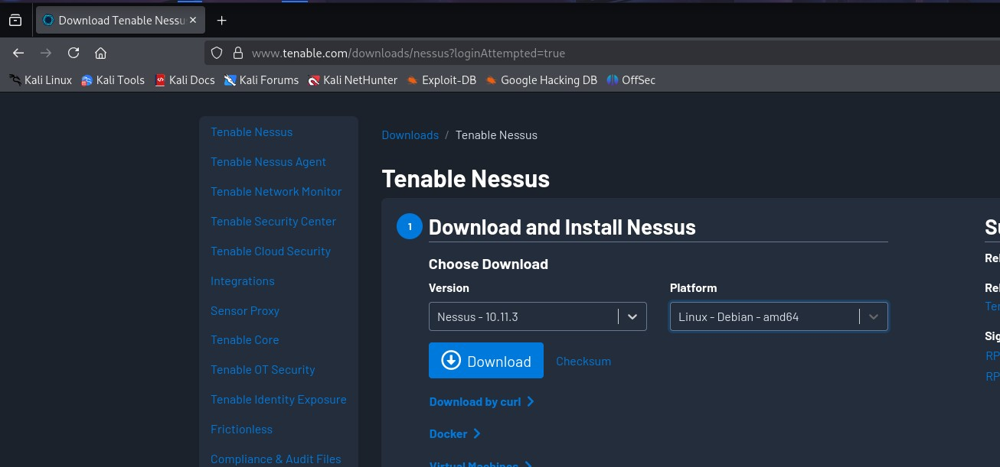
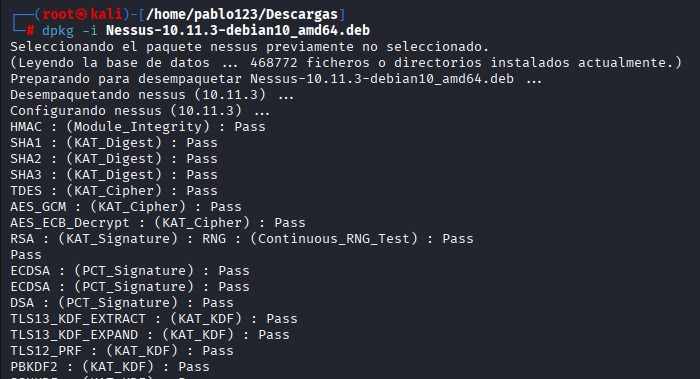
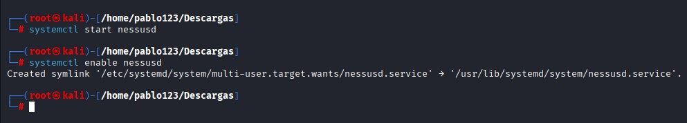
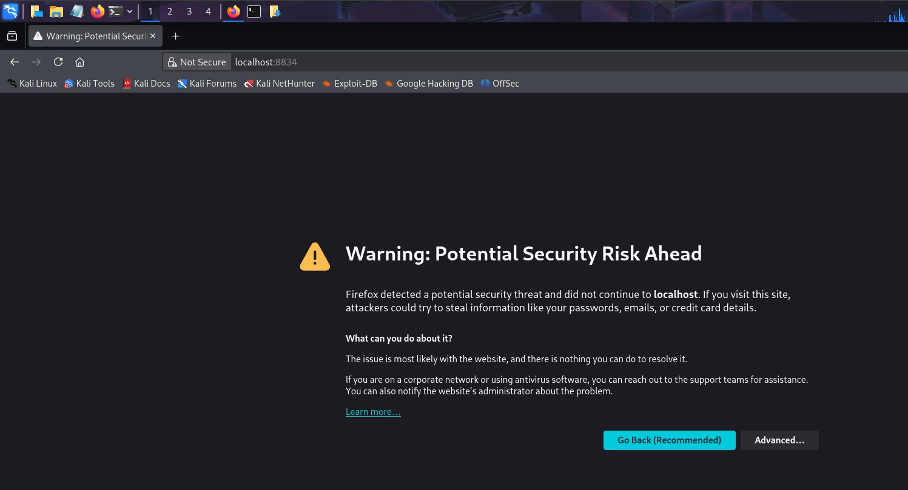
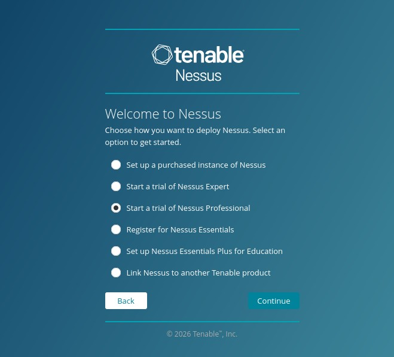
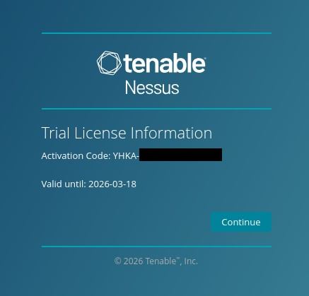
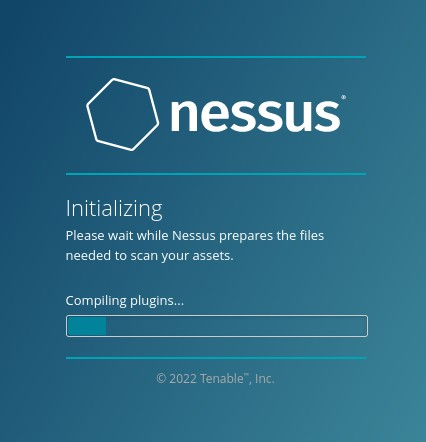

# 🛡️ Nessus Professional: Technical Deployment & Usage Guide

This project provides a comprehensive guide on deploying, configuring, and using **Nessus Professional** to perform vulnerability assessments in a controlled lab environment.

---

## 📖 Table of Contents
1. [What is Nessus Professional?](#1-what-is-nessus-professional)
2. [Reference Deployment Environment](#2-reference-deployment-environment)
3. [Deployment & Configuration Guide](#3-deployment--configuration-guide)
4. [Standard Operating Procedure: Vulnerability Scanning](#4-standard-operating-procedure-vulnerability-scanning)
5. [Reporting & Analysis of Results](#5-reporting--analysis-of-results)

---

## 1. What is Nessus Professional?

**Nessus Professional** is the industry-standard vulnerability assessment solution for security practitioners developed by **Tenable**. It is designed to automate the point-in-time identification of vulnerabilities, configuration issues, and malware across a wide range of assets.

In professional production environments, Nessus is a core component of the **Vulnerability Management (VM) lifecycle**, providing the data required for risk assessment and remediation planning.

### Core Functionalities:
* **Comprehensive Detection:** Features over **180,000 plugins**, updated daily to cover the latest vulnerabilities (CVEs), malware, and configuration trends.
* **Scalable Scanning:** Capable of auditing cloud infrastructure, virtualized environments, and physical network devices (routers, switches, firewalls).
* **Compliance Auditing:** Includes templates for industry standards such as **PCI DSS, HIPAA, and CIS Benchmarks**, allowing organizations to verify if their systems meet regulatory requirements.
* **Authenticated vs. Unauthenticated Scans:**
    * *Unauthenticated:* Provides an "outside-in" view of what an attacker can discover without credentials.
    * *Authenticated (Credentialed):* Logs into the system to perform a deep inspection of local software, registry keys, and missing patches.

---

## 2. Reference Deployment Environment

To demonstrate the tool's capabilities, this manual utilizes a standard virtualization architecture:

* **Scanner Node:** Kali Linux (Debian-based) running Nessus Professional.
* **Host System:** Windows 11 (Physical Host).
* **Hypervisor:** Oracle VM VirtualBox.
* **Target Node:** Ubuntu Desktop.

> **Note:** Proper network configuration in VirtualBox is crucial. Both the Scanner and the Target must be on the same subnet to allow Nessus to perform successful discovery and deep packet inspection.

---

## 3. Deployment & Configuration Guide

The deployment of Nessus Professional follows a standardized process: acquisition of the official package, installation of the service, and initialization of the plugin database.

### 3.1. Package Acquisition
Before installation, the Nessus binary must be obtained from the official vendor repository:
1. Navigate to the [Tenable Download Portal](https://www.tenable.com/downloads/nessus).
2. Select the appropriate package: **Linux - Debian - amd64**.
3. Download the `.deb` file to your target system (e.g., `~/Downloads`).



### 3.2. Installation on Linux (Debian/Kali)
Once the package is downloaded, execute the following command in the terminal to install it:

```bash
dpkg -i Nessus-10.x.x-debian10_amd64.deb
```



After installation, activate the Nessus daemon (nessusd) to start the service:

```bash
systemctl start nessusd
systemctl enable nessusd
```



### 3.3. Initial Setup
Access the management console via https://localhost:8834.
* **Security Note:**: A browser warning will appear due to the self-signed SSL certificate; select "Advanced" and "Proceed" to continue.



* **Trial Activation:** Select the option **"Start a trial of Nessus Professional"**.



* **Registration:** In the following screen, provide your email address. You will receive an activation code in your inbox.
* **License Activation:** After verifying your email and obtaining the **Activation Code**, press "Continue" to proceed.



* **User Account Creation:** Create your primary administrator account by defining a secure username and password.
* **Plugin Initialization:** The system will automatically download and compile the vulnerability plugins. This is a vital step, as it defines the scanner's detection capabilities.


